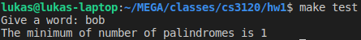
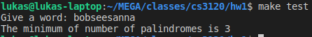
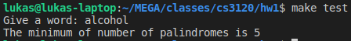
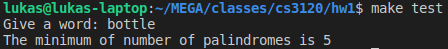
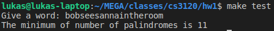

# Homework 1

1. Consider an arbitrary string *s* made up from the alphabet "a" through "z" (no other symbols and no blanks). Design a Divide and Conquer algorithm to compute MinPal(s). You will write a complete paragraph explaining the principle of your algorithm (provide the recursive formulation you use). Then write a complete pseudo code of your algorithm with enough comments and declarations of the data structures you use.
   * Let $s_{i...j}$ to be the substring of *s* starting with index *i* and ending with index *j* where $0 \le i \lt j \lt length(s)$. 

   * There are three cases which define our subproblems that can happen on every substring $s_{i...j}$:

     1. $i = j$

        * $MinPal(s_{i...j}) = 1$ if $i = j$ since any string with length 1 is also a palindrome.

     2. $i < j$ and $s_{i...j}$ is a palindrome

        * We claim that $MinPal(s_{i...j}) = 1$. To prove this claim, we assume that this is not true. Then, $\exists$ $MinPal(s_{i...k}) + MinPal(s_{k+1...j}) \lt 1$ where $k$ is ${k \in \mathbb{Z}: i \le k \lt j}$. This contradicts the assumption because $MinPal(x) \ge 1$ where $x$ is any non-empty string. Therefore, it is proven that there is no way to get a fewer number of palindromes to construct $s_{i...j}$ by splitting the word into $s_{i...k}$ and $s_{k+1...j}$.

     3. $i < j$ and $s_{i...j}$ is not a palindrome

        *  $\forall$ $ {k \in \mathbb{Z}: i \le k \lt j}$  (where k is defines all pairs of substrings $s_{i...k}$ and $s_{k+1...j}$ which when concatenated construct $s_{i...j}$) the optimal solution is defined by: 

          $MinPal(s_{i...j}) = min_{i \le k \lt j} \{MinPal(s_{i...k}) + MinPal(s_{k+1...j})\}$


**To summarize:**
$$
MinPal(s_{i...j}) =
	\begin{cases}
	1 & \text{if }i = j \\
	1 & \text{if } i \lt j \text{ and } s_{i...j} \text{ is a palindrome} \\
	min_{i \le k \lt j} \{MinPal(s_{i...k}) + MinPal(s_{k+1...j})\} & \text{if } i < j \text{ and } s_{i...j} \text{ is not a palindrome}
	\end{cases}
$$
**Pseudocode:**

```
// s is a string
// i and j are indices of string s where 0 <= i < j < length(s)
// return: the minimum of palindromes to construct s
MinPal(s, i, j)
	// Case 1 and case 2
	if i == j or is_palindrome(s, i, j)
		return 1
	
	// Case 3
	m = INFINITY
	for k = i to j - 1
		m = min(m, MinPal(s, i, k) + MinPal(s, k + 1, j))
	return m
```

2. Show that the running time of MinPal(s) is exponential in the length *n* of *s*.
   * Let *n* to be the length of *s*

   * When $n = 1$, there is only one case:
     1. *s* is a palindrome. 
        * Therefore,  the running time is constant because there is only one palindrome to construct *s* . 

   * When $n \ge 2$, there are two cases:
     1. *s* is a palindrome
        * If this is the case, it's not necessary to search further because we are certain that further search will not reveal a smaller number of palindrome. This took O(n) running time because we looked at all of the letters to determine that it is a palindrome. 
     2. *s* is not a palindrome
        * $\exist$ two substrings which when concatenated construct *s*. The two substrings can be found between the $k^{th}$ and $(k + 1)^{st}$ indices for any $k = 1, 2, ..., n - 1$. Therefore, we obtain the recurrence:

     $$
     P(n) =
     	\begin{cases}
     		1 & \text{if } n = 1 \\
     		n + \sum\limits_{k = 1}^{n - 1} P(k) P(n - k) & \text{if }n \ge 2
     	\end{cases}
     $$

     ​

   * $\sum\limits_{k = 1}^{n - 1} P(k) P(n - k)$ satisfies the recurrence relations of the Catalan numbers. Since Catalan numbers' growth is lower bounded by $\Omega(2^n)$[^1] (see also [^2] [^3]), the extra term $n$ in $n + \sum\limits_{k = 1}^{n - 1} P(k) P(n - k)$ is less than the $\Omega(2^n)$ so, it is negligible. Therefore, the running time complexity for this algorithm is still lower bounded by an exponential running time, $\Omega(2^n)$ 


3. Design a Dynamic Programming $O(n^3)$ algorithm to solve the problem (show that your algorithm is $O(n^3)$; write a program to implement and show experimental results.

   **C Code:**

   ```c
   #include <string.h>
   #include <limits.h>
   #include <stdlib.h>
   #define min(a, b) a < b ? a : b

   int is_palindrome(char *s, int l, int r)
   {
       while (l < r)
           if (s[l++] != s[r--])
               return 0;
       return 1;
   }

   int min_pal(char *s)
   {
       // Initialization
       int len = strlen(s);
       int **mem = calloc(sizeof(int *), len);
       for (int i = 0; i < len; i++)
           mem[i] = calloc(sizeof(int), len);

       // Set the base case for all substrings with length 1
       for (int i = 0; i < len; i++)
           mem[i][i] = 1;

       for (int l = 2; l <= len; l++)
       {
           for (int i = 0; i <= len - l; i++)
           {
               int j = i + l - 1;
               mem[i][j] = INT_MAX;
               if (is_palindrome(s, i, j))
                   mem[i][j] = 1;
               else
                   for (int k = i; k < j; k++)
                       mem[i][j] = min(mem[i][j], mem[i][k] + mem[k + 1][j]);
           }
       }

       // Free all used memories
       int ans = mem[0][len - 1];
       for (int i = 0; i < len; i++)
           free(mem[i]);
       free(mem);

       return ans;
   }
   ```

   ​

   **Running Time Complexity:**


   * Let $n$ to be the length of $s$
   * Initialization and set base case (assume calloc's running time is $O(n)$): $O(n^2)$
     * In this case, it doesn't affect the overall running time whether calloc is $O(1)$ or $O(n)$ because the core algorithm is $O(n^3)$. 
   * The core algorithm: $O(n^3)$
     * The first for-loop (line 26): $O(n)$
       * The second for-loop (line 28): $O(n)$
         * The call "is_palindrome" (line 32): $O(n)$
         * The third for-loop (line 35): $O(n)$

   **Total running time of min_pal(s) is $O(n^3)$**

   

**Experiment 1:**



**Experiment 2:**



**Experiment 3:**



**Experiment 4:**



**Experiment 5:**




[^1]: Srimani 3120 Spring 2018 DP_3120_4_F18.pdf page 7
[^2]: http://mathworld.wolfram.com/CatalanNumber.html Catalan Number Overview
[^3]: https://en.wikipedia.org/wiki/Catalan_number#Properties Catalan Number Running time